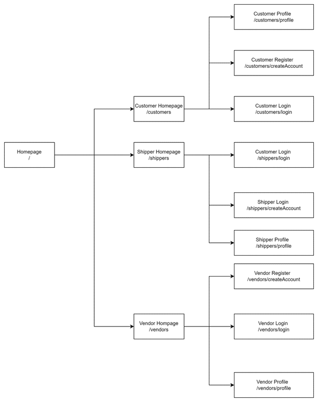
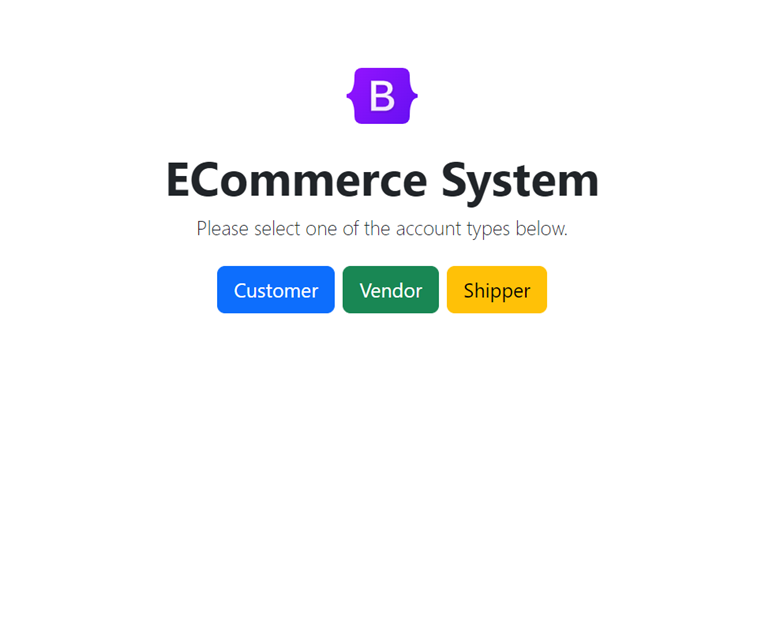

# php-online-shopping-web-app

## General

* PHP Online Shopping Web is a web application that can help customers to purchase items, vendors to add new products and shippers to receive orders and update their status.
* The project consists of two main components:
    * api: a web service that manages data for the online shopping application
    * ui interface: a set of web pages that shippers, customers and shippers can interfaction
## Sitemap
* This is the site map for the front-end part of the project application

## Getting Started
### Configure Application

* Install required tools
    * PHP (>= 7.0): https://www.php.net/downloads.php
    * Postman (for testing web service in PHP): https://www.postman.com/downloads/
* Clone the project this project using the following commands:
```
https://github.com/michael-loc009/php-online-shopping-web-app.git
```

### Run the back-end application

* Go the the location where the project is cloned and run the following command
```
cd api
php -S 127.0.0.1:8001
```

* Open postman application and imports the following files in the **docs/postman** folder:
    * PHP Online Shop API.postman_collection.json
    * [Local] PHP Online Shopping API.postman_environment.json
* If successful, you will get this response when running the url http://127.0.0.1:8000/api/api/orderStatus

```
[
    {
        "OrderStatusID": 1,
        "Label": "active"
    },
    {
        "OrderStatusID": 2,
        "Label": "delivered"
    },
    {
        "OrderStatusID": 3,
        "Label": "canceled"
    }
]
```
### Run the front-end application

* Go the the location where the project is cloned and run the following command
```
cd public
php -S 127.0.0.1:8000
```

* Go the link to open the web application: [http:// 127.0.0.1:8000](http://127.0.0.1:8000) 

* If successful, you should see the index page as belows:



